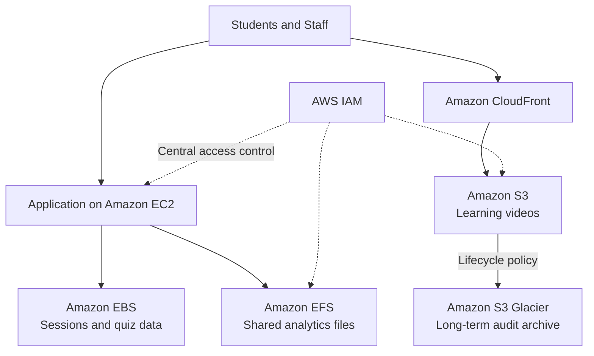

# AWS Cloud Storage Strategy for an Education Platform

An individual Cloud Computing Foundations case study that evaluates storage services by workload behavior rather than forcing every workload into a single storage model.

## Scenario

An education platform needs to support transactional sessions and quiz data, large learning videos, shared analytics datasets, and long-term audit archives. Each workload has different performance, access, durability, collaboration, and cost requirements.

## Recommended architecture

## Decision summary

| Workload | Recommended service | Main reason |
|---|---|---|
| Sessions and quiz results | Amazon EBS | Low-latency block storage for transactional access |
| Learning videos | Amazon S3 + CloudFront | Scalable object storage and geographic content delivery |
| Shared analytics datasets | Amazon EFS | Concurrent file access from multiple compute instances |
| Long-term audit records | Amazon S3 Glacier | Durable, lower-cost archival storage |

## Evaluation criteria

- Performance and latency
- Scalability and availability
- Durability and lifecycle
- Concurrent access requirements
- Security and centralized IAM controls
- Operational complexity and cost

## Key conclusion

Cloud architecture is a series of trade-offs. A simpler management model does not require a single storage service; it can use centralized access controls, naming conventions, lifecycle policies, monitoring, and documentation while still choosing the right storage model for each workload.

## Project status

Individual academic case study. No production infrastructure or customer data is included.
